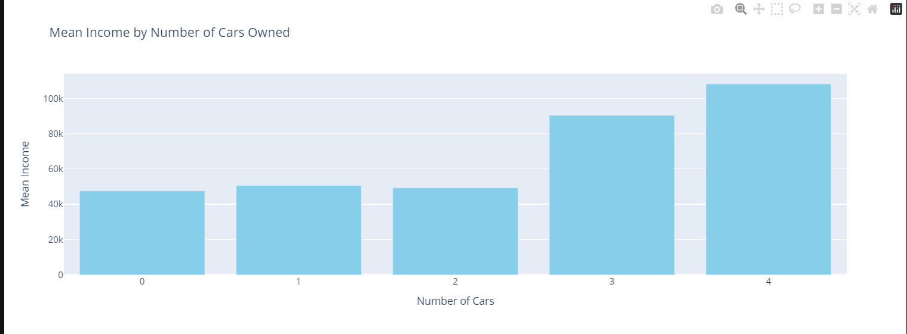
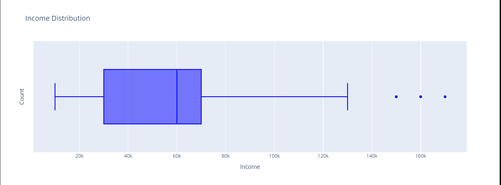
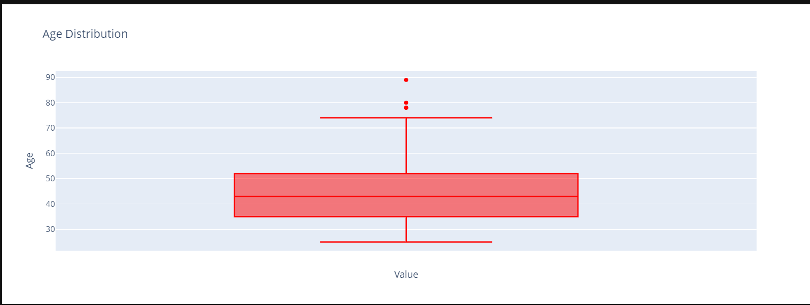
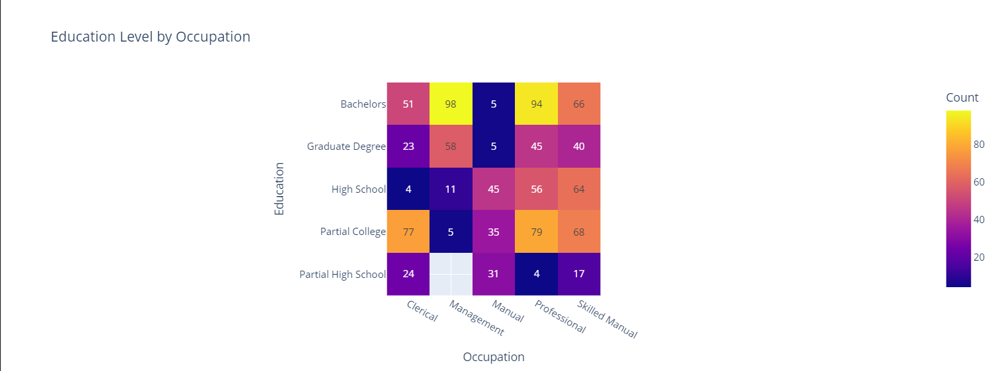
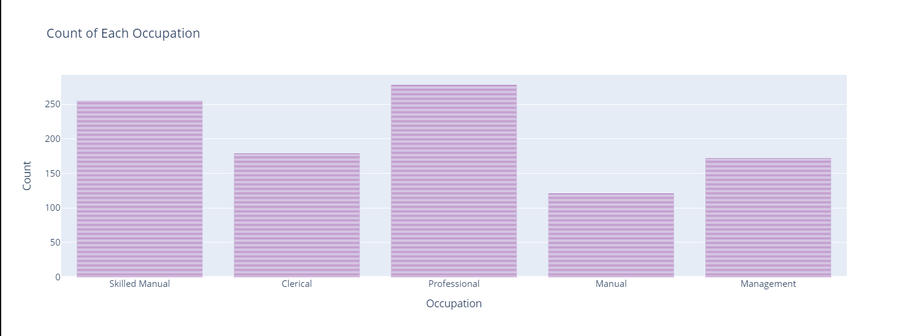
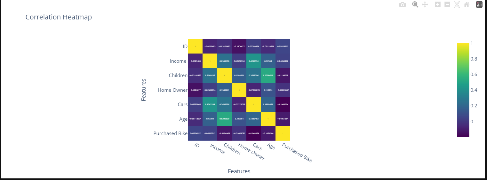
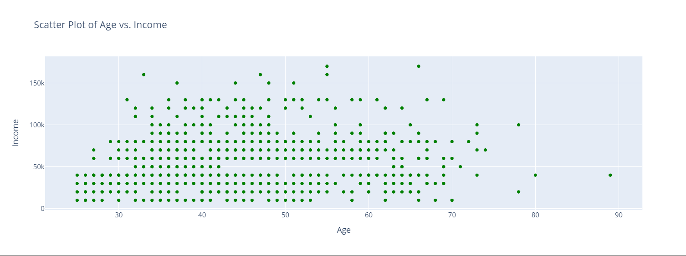

# Data Analysis Project - Employee Insights

This project performs data cleaning, transformation, and descriptive analysis on an employee dataset. It includes:

- Demographic summaries (age, gender, marital status)
- Behavioral insights (bike purchase behavior, commute distances)
- Income analysis by region and education
- Visualization of trends using plots and charts

## 🔍 Visualization

The project includes **interactive visualizations** using Plotly.  
Since GitHub doesn't render interactive charts directly, a **screenshot** of the output is saved in the folder [`pic/`](./pic/).

### Screenshots from Python Code

- 
- 
- 
- 
- 
- 
- 

## 📁 Folder Structure

- `pic/` — contains screenshots of the interactive visualizations
- `your_notebook_or_script.py` — contains all analysis and visualizations

## ⚙️ Tools Used

- Python (Pandas, Matplotlib, Seaborn, Plotly)
- Jupyter Notebook
